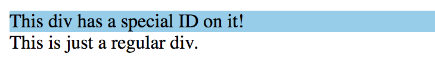

## Selectors ##

### Best Practice ###

* 组合选择器貌似可以级联，最好不写级联格式

### Basic Selectors ###

* [universal selector](https://developer.mozilla.org/en-US/docs/Web/CSS/Universal_selectors)
  - 慎用，CSS3起可以同namespace一起使用(TODO), 譬如ns|*
  - ```
    * { style properties }
    ```
  - ```css
    /* Selects all elements */
    * { color: green; }
    ```

* [type selector](https://developer.mozilla.org/en-US/docs/Web/CSS/Type_selectors) matches elements of the given type within a document
  - ```
    element { style properties }
    ```
  - ```html
    <head>
    <style>
      a{
        border: thin black solid; padding: 4px;
      }
    </style>
    </head>
    <body>
    <a href="http://apress.com">Visit the Apress website</a>
    <p>I like <span>apples</span> and oranges.</p>
    <a href="http://w3c.org">Visit the W3C website</a>
    </body>
    ```
  - 

* [attribute selector](https://developer.mozilla.org/en-US/docs/Web/CSS/Attribute_selectors) matches elements based on the presence or value of a given attribute
  - attribute may contain multiple values
  - The string comparision is case-sensitive. Avoid to use `[attr operator "value" i]`.
  - Syntax
    - `<element>[attr]` elements with attribute "attr" defined
    - `<element>[attr="value"]` elements with attribute "attr" whose value is "value"
    - `<element>[attr~="value"]` elements with attribute "attr" whose value continas multiple values and one of which is "value"
    - `<element>[attr|="value"]` elements with attribute "attr" whose value is a hyphen- seperated value("en-Us", etc), the first of which is "value"
    - `<element>[attr^="value"]` elements with attribute "attr" whose value starts with "value"
    - `<element>[attr$="value"]` elements with attribute "attr" whose value ends with "value"
    - `<element>[atrr*="value"]` elements with attribute "attr" whose value contains string "value"
  - ```html
    <head>
      <style>
        [href] {
          border: thin black solid;
          padding: 4px;
        }
      </style>
    </head>
    <body>
      <a id="apressanchor" class="class1 class2" href="http://apress.com">
        Visit the Apress website
      </a>
      <p>I like <span class="class2">apples</span> and oranges.</p>
      <a id="w3canchor" href="http://w3c.org">Visit the W3C website</a>
    </body>
    ```
  - 

* [class selector](https://developer.mozilla.org/en-US/docs/Web/CSS/Class_selectors) matches elements based on the content of their class attribute
  - ```
    <element>.class_name { style properties }

    it is equivalent to
    [class~="class_name"]
    ```
  - ```html
    <head>
      <style>
        .classy { background-color: skyblue; }
      </style>
    </head>
    <body>
      <div class="classy">This div has a special class on it!</div>
      <div class="foo classy bar">Elements can have multiple classes and the class selector still works!</div>
      <div>This is just a regular div.</div>
    </body>
    ```
  - 

* [id selector](https://developer.mozilla.org/en-US/docs/Web/CSS/ID_selectors) matches elements based on the value of its id attribute
  - ```
    <element>#id_value { style properties }

    it is equivalent to
    [id=value] { style properties }
    ```
  - ```html
    <head>
      <style>
        #identified { background-color: skyblue; }
      </style>
    </head>
    <body>
      <div id="identified">This div has a special ID on it!</div>
      <div>This is just a regular div.</div>
    </body>
    ```
  - 

### Combining Sectors ###
* *union selector*(TODO), matches union of all the elements that each of the individual selectors matches.
  - ```
    <selector>, <selector> ... { style properties }
    ```
  - ```html
    <head>
      <style>
        a, [lang|="en"] { border: thin black solid; padding: 4px;}
      </style>
    </head>
    <body>
      <a id="apressanchor" class="class1 class2" href="http://apress.com">
        Visit the Apress website
      </a>
      <p>I like <span lang="en-uk" class="class2">apples</span> and oranges.</p>
      <a id="w3canchor" href="http://w3c.org">Visit the W3C website</a>
      </body>
    ```
  - 

* [descendant selector](https://developer.mozilla.org/en-US/docs/Web/CSS/Descendant_selectors) matches elements that match the 2nd selector and are descendants of the elements match the 1st selector
  - ```
    <selector1> <selector2> { style properties }
    ```
  - ```html
    <head>
      <style>
        #mytable td {
          border: thin black solid;
          padding: 4px;
        }

        li {
          list-style-type: disc;
        }

        li li {
          list-style-type: circle;
        }
      </style>
    </head>
    <body>
      <table id="mytable">
        <tr><th>Name</th><th>City</th></tr>
        <tr><td>Adam Freeman</td><td>London</td></tr>
        <tr><td>Joe Smith</td><td>New York</td></tr>
        <tr><td>Anne Jones</td><td>Paris</td></tr>
      </table>
      <p>I like <span lang="en-uk" class="class2">apples</span> and oranges.</p>
      <table id="othertable">
        <tr><th>Name</th><th>City</th></tr>
        <tr><td>Peter Pererson</td><td>Boston</td></tr>
        <tr><td>Chuck Fellows</td><td>Paris</td></tr>
        <tr><td>Jane Firth</td><td>Paris</td></tr>
      </table>

      <ul>
        <li>
          <div>Item 1</div>
          <ul>
            <li>Subitem A</li>
            <li>Subitem B
              <ul>
                <li> item1 </li>
                <li> item2 </li>
              </ul>
            </li>
          </ul>
        </li>
        <li>
          <div>Item 2</div>
          <ul>
            <li>Subitem A</li>
            <li>Subitem B</li>
          </ul>
        </li>
      </ul>
    </body>
    ```
  - 

* [child selector](https://developer.mozilla.org/en-US/docs/Web/CSS/Child_selectors) matches elements that match the 2nd selector and are *immediate* descendants of the elements match the 1st selector
  - ```
    <selector1> > <selector2> { style properties }
    ```
  - ```html
    <head>
      <style>
        body > * > span, tr > th {
          border: thin black solid;
          padding: 4px;
        }
      </style>
    </head>
    <body>
      <table id="mytable">
        <tr><th>Name</th><th>City</th></tr>
        <tr><td>Adam Freeman</td><td>London</td></tr>
        <tr><td>Joe Smith</td><td>New York</td></tr>
        <tr><td>Anne Jones</td><td>Paris</td></tr>
      </table>
      <p>I like <span lang="en-uk" class="class2">apples</span> and oranges.</p>
      <table id="othertable">
        <tr><th>Name</th><th>City</th></tr>
        <tr><td>Peter Pererson</td><td>Boston</td></tr>
        <tr><td>Chuck Fellows</td><td>Paris</td></tr>
        <tr><td>Jane Firth</td><td>Paris</td></tr>
      </table>
    </body>
    ```
  - 

* *[adjacent silbing selector](https://developer.mozilla.org/en-US/docs/Web/CSS/Adjacent_sibling_selectors) matches elements that match the 2nd element and immediately follow an element that matches the 1st selector  
  [general silbing selector](https://developer.mozilla.org/en-US/docs/Web/CSS/General_sibling_selectors) matches elemments that match the 2nd element and follow an element that matches the 1st selector
  - ```
    <selector1> + <selector2> { style properties }
    <selector1> ~ <selector2> { style properties }
    ```
  - ```html
    <head>
      <style>
        p + a {
          border: thin black solid; padding: 4px;
        }
      </style>
    </head>
    <body>
      <a href="http://apress.com">Visit the Apress website</a>
      <p>I like <span lang="en-uk" class="class2">apples</span> and oranges.</p>
      <a href="http://w3c.org">Visit the W3C website</a>
      <a href="http://google.com">Visit Google</a>
    </body>
    ```
  - 
  - ```html
    <head>
      <style>
        p ~ a {
          border: thin black solid; padding: 4px;
        }
      </style>
    </head>
    <body>
      <a href="http://apress.com">Visit the Apress website</a>
      <p>I like <span lang="en-uk" class="class2">apples</span> and oranges.</p>
      <a href="http://w3c.org">Visit the W3C website</a>
      <a href="http://google.com">Visit Google</a>
    </body>
    ```
  - 

### Pseudo-Element Selector[TODO] ###

* [::first-line](https://developer.mozilla.org/en-US/docs/Web/CSS/::first-line) matches the first line of a [block-level](https://developer.mozilla.org/en-US/docs/Web/CSS/Visual_formatting_model#Block-level_elements_and_block_boxes) element
  - Prefer :first-line than ::first-line to keep consistency with pseudo-class selector
  - No all properties can be applied to first-line
* [::first-letter](https://developer.mozilla.org/en-US/docs/Web/CSS/::first-letter) matches the the first letter of first line of a block-level element
* :before and :after

### Pseudo-Class Selector ###

* [:root](https://developer.mozilla.org/en-US/docs/Web/CSS/:root) matches the root element of the document, usually html element
* child selector matches single element that are directly contained inside other elements
  - [:first-child](https://developer.mozilla.org/en-US/docs/Web/CSS/:first-child) matches the first children
  - [:last-child](https://developer.mozilla.org/en-US/docs/Web/CSS/:last-child) matches the last children
  - [:only-child](https://developer.mozilla.org/en-US/docs/Web/CSS/:only-child) matches an element without any silbings.
     - be equivalent to :firstchild:lastchild or :nth-child(1):nth-last-child(1)
  - [:only-of-type](https://developer.mozilla.org/en-US/docs/Web/CSS/:only-of-type) matches an element that has no silbings of the same type
  - ```html
    <head> <title>Example</title> <style type="text/css">
        :first-child:last-child {
        border: thin black solid;
        padding: 4px;
        } </style>
    </head>
    <body>
        <a href="http://apress.com">Visit the Apress website</a>
        <p>I like <span>apples</span> and oranges.</p>
        <a href="http://w3c.org">Visit the W3C website</a>
    </body>
    ```
   - 
   - ```html
     <html>
     <head> <title>Example</title> <style type="text/css">
         body *:only-of-type {
         border: thin black solid;
         padding: 4px;
         } </style>
     </head>
     <body>
         <a href="http://apress.com">Visit the Apress website</a>
         <p>I like <span>apples</span> and oranges.</p>
         <a href="http://w3c.org">Visit the W3C website</a>
     </body>
     </html>
     ```
  - 

* the nth-child selector allow you to sepecify an index to match elements in a paticular position
  - [:nth-child(n)](https://developer.mozilla.org/en-US/docs/Web/CSS/:nth-child) matches elements based on their position among a group of silbings
    - ```
        :nth-child(<nth> [ of <selector>#]?)
         nth = even | odd | an-plus-b
      ```
    - tr:nth-child(odd) or tr:nth-child(2n+1)  
      Represents the odd rows of an HTML table: 1, 3, 5, etc.
    - tr:nth-child(even) or tr:nth-child(2n)  
      Represents the even rows of an HTML table: 2, 4, 6, etc.
    - :nth-child(7)  
      Represents the seventh element.
    - :nth-child(5n)  
      Represents elements 5 [=5×1], 10 [=5×2], 15 [=5×3], etc.
    - :nth-child(3n+4)  
      Represents elements 4 [=(3×0)+4], 7 [=(3×1)+4], 10 [=(3×2)+4], 13 [=(3×3)+4], etc.
    - :nth-child(-n+3)  
      Represents the first three elements. [=-0+3, -1+3, -2+3]
    - p:nth-child(n)  
      Represents every <p> element in a group of siblings. This selects the same elements as a simple p selector (although with a higher specificity).
    - p:nth-child(1) or p:nth-child(0n+1)  
      Represents every <p> that is the first element in a group of siblings. This is the same as the :first-child selector (and has the same specificity).
    - p:nth-child(n+8):nth-child(-n+15)  
      Represents the eighth through the fifteenth <p> elements of a group of siblings.
    - ```html
      <html>
        <head> <title>Example</title> <style type="text/css">
            html {
            font-family: sans-serif;
            }

            span,
            div em {
            padding: 5px;
            border: 1px solid green;
            display: inline-block;
            margin-bottom: 3px;
            }

            .first span:nth-child(2n+1),
            .second span:nth-child(2n+1),
            .third span:nth-of-type(2n+1) {
            background-color: lime;
            }   </style>
        </head>
        <body>
            <h3><code>span:nth-child(2n+1)</code>, WITHOUT an
            <code>&lt;em&gt;</code> among the child elements.</h3>
            <p>Children 1, 3, 5, and 7 are selected.</p>
            <div class="first">
            <span>Span 1!</span>
            <span>Span 2</span>
            <span>Span 3!</span>
            <span>Span 4</span>
            <span>Span 5!</span>
            <span>Span 6</span>
            <span>Span 7!</span>
            </div>

            <br>

            <h3><code>span:nth-child(2n+1)</code>, WITH an
            <code>&lt;em&gt;</code> among the child elements.</h3>
            <p>Children 1, 5, and 7 are selected.<br>
            3 is used in the counting because it is a child, but it isn't
            selected because it isn't a <code>&lt;span&gt;</code>.</p>
            <div class="second">
            <span>Span!</span>
            <span>Span</span>
            <em>This is an `em`.</em>
            <span>Span</span>
            <span>Span!</span>
            <span>Span</span>
            <span>Span!</span>
            <span>Span</span>
            </div>

            <br>

            <h3><code>span:nth-of-type(2n+1)</code>, WITH an
            <code>&lt;em&gt;</code> among the child elements.</h3>
            <p>Children 1, 4, 6, and 8 are selected.<br>
            3 isn't used in the counting or selected because it is an <code>&lt;em&gt;</code>, 
            not a <code>&lt;span&gt;</code>, and <code>nth-of-type</code> only selects
            children of that type. The <code>&lt;em&gt;</code> is completely skipped
            over and ignored.</p>
            <div class="third">
            <span>Span!</span>
            <span>Span</span>
            <em>This is an `em`.</em>
            <span>Span!</span>
            <span>Span</span>
            <span>Span!</span>
            <span>Span</span>
            <span>Span!</span>
            </div>
        </body>
        </html>
      ```
    - 

## References ##

* [CSS Specification?](https://drafts.csswg.org/selectors/#syntax)
* [MDN CSS Reference](https://developer.mozilla.org/en-US/docs/Web/CSS/Reference)
