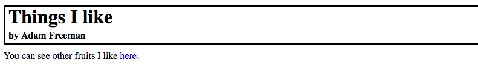
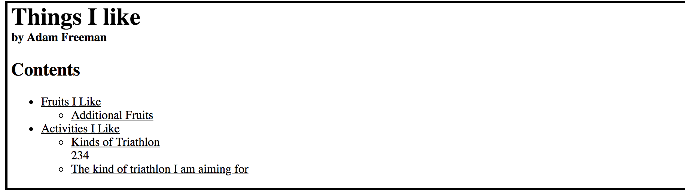
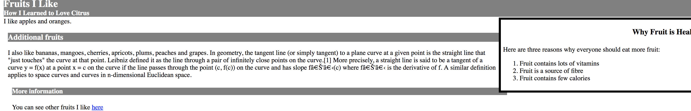
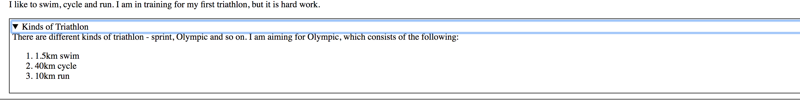
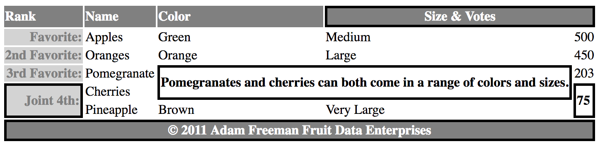

### [CSS](doc/css.md) ###

### Element Categories ###

* [MDN Reference](https://developer.mozilla.org/en-US/docs/Web/Guide/HTML/Content_categories#Flow_content)
* [relevant portions of the HTML specification](https://html.spec.whatwg.org/multipage/dom.html#kinds-of-content)

### Grouping Content ###

* 表示段落[p](https://html.spec.whatwg.org/multipage/grouping-content.html#the-p-element)
  - ```css
    p { display: block; margin-before: 1em; marge-after: 1em; margin-start:0; margin-end: 0; }
    ```
* 应用全局属性到一片内容上，可是不表示任何内容分组[div](https://html.spec.whatwg.org/multipage/grouping-content.html#the-div-element)
  - 最后的选择，　优先考虑语义元素
  - ```css
    div { display: block; }
    ```
* 保留ＨＴＭＬ文档中的布局[pre](https://html.spec.whatwg.org/multipage/grouping-content.html#the-pre-element)
  - pre阻止渲染时候空白符的合并
  - ```css
    pre { display: block; font-family: monospace; white-space: pre; margin: 1em 0; }
    ```
* 表示引自他处的内容[blockquote](https://html.spec.whatwg.org/multipage/grouping-content.html#the-blockquote-element)
  - 相比**q**, blockquote通常用在需要引用更多内容情况下
  - ```css
    blockquote { display: block; margin-before: 1em; margin-after: 1em; margin-start: 40px; margin-end: 40px; }
    ```
* 表示段落级别的主题转换[hr](https://html.spec.whatwg.org/multipage/grouping-content.html#the-hr-element)
  - ```css
    hr { display: block; margin-before: 0.5em; margin-after: 0.5em; margin-start: auto; margin-end: auto;
         border-style: inset; border-width: 1px; }
    ```
* 有序列表[ol](https://html.spec.whatwg.org/multipage/grouping-content.html#the-ol-element)
  - 可以通过ｔｙｐｅ属性设置标号类型
    - 1 十进制（默认）
    - a 小写拉丁字母
    - A 大写拉丁字母
    - i 小写罗马数字
    - Ｉ 大写罗马数字
  - 可以通过start属性设置首项编号值，另外可以通过ｌｉ的ｖａｌｕｅ强行指定某一项的值编号
  - reversed属性指定标号降序排列
  - ```css
    ol { display: block; list-style-type: decimal; margin-before: 1em; margin-after: 1em;
         margin-start: 0; margin-end: 0; padding-start: 40px;
       }
    ```
* 无序列表[ul](https://html.spec.whatwg.org/multipage/grouping-content.html#the-ul-element)
  - ```css
    ul { display: block; list-style-type: disc; margin-before: 1em; margin-after: 1em;
         margin-start: 0; margin-end: 0; padding-start: 40px;
       }
    ```
* 说明列表[dl](https://html.spec.whatwg.org/multipage/grouping-content.html#the-dl-element)
  - **dl**需要配合属于[dt](https://html.spec.whatwg.org/multipage/grouping-content.html#the-dt-element)和定义[dd](https://html.spec.whatwg.org/multipage/grouping-content.html#the-dd-element])
  - ```css
     dl { display: block; margin-before: 1em; margin-after: 1em; margin-start: 0; margin-end: 0; }
     dt { display: block; }
     dd { display: block; margin-start: 40px; }
     ```
* 表示插图[figure](https://html.spec.whatwg.org/multipage/grouping-content.html#the-figure-element)
  - ```html
    <figure>
      <figcaption>Listing 23. Using the code element</figcaption>
      <code>var fruits = ["apples", "oranges", "mangoes", "cherries"];<br>
      document.writeln("I like " + fruits.length + " fruits");
      </code>
    </figure>
    ```
  -  
  - ```css
    figure { display: block; margin-before: 1em; margin-after-after: 1em; margin-start: 40px; margin-after: 40px; }
    figcaption { display: block; }
    ```
### Section Element ###
* HTML文档内容的开始[body](https://html.spec.whatwg.org/multipage/sections.html#the-body-element)
  - ```css
    body { display: block; margin: 8px; }
    body:focus { outline: none; }
    ```
* 常用标题[h1-h3](https://html.spec.whatwg.org/multipage/sections.html#the-h1,-h2,-h3,-h4,-h5,-and-h6-elements)
  - ```css
    h1 { display: block; font-size: 2em; margin-before: 0.67em; margin-after: 0.67em;
        margin-start: 0; margin-end: 0; font-weight: bold;
       }
    ```
* 表示一组标题, 其中只有一个可以出现在文档大纲中[hgroup](https://html.spec.whatwg.org/multipage/sections.html#the-hgroup-element)
  - hgroup主要用来解决子标题的问题
  - ```html
    <hgroup>
      <h1>Fruits I Like</h1>
      <h2>How I Learned to Love Citrus</h2>
    </hgroup>
    I like apples and oranges.
    ```
  - 
* 表示一个重要的主题或者概念[section](https://html.spec.whatwg.org/multipage/sections.html#the-section-element)
  - section的样式默认并无特别之处，而且各浏览器section里面标题的处理不一致。因此section主要用于语义上的结构支持，样式上如果有需要，需要自定义CSS
  - ```css
    section { display: block; }
    ```
* 表示首部[header](https://html.spec.whatwg.org/multipage/sections.html#the-header-element)和尾部[footer](https://html.spec.whatwg.org/multipage/sections.html#the-footer-element)
  - header和footer的父元素可以是任何可以包含流元素的元素，重在语义，样式默认无特殊
  - ```html
    <p>
      <header>
        <hgroup>
          <h1>Things I like</h1>
          <h2>by Adam Freeman</h2>
        </hgroup>
      </header>
      You can see other fruits I like <a href="fruitlist.html">here</a>.
    </p>
    ```
  - 
  - ```css
    header { display: block; }
    footer { display: block; }
    ```
* 表示导航元素集合[nav](https://html.spec.whatwg.org/multipage/sections.html#the-nav-element)
  - ```html
    <header>
      <hgroup>
        <h1>Things I like</h1>
        <h2>by Adam Freeman</h2>
      </hgroup>
      <nav>
          <h1>Contents</h1>
          <ul>
            <li><a href="#fruitsilike">Fruits I Like</a></li>
            <ul>
                <li><a href="#morefruit">Additional Fruits</a></li>
            </ul>
            <li><a href="#activitiesilike">Activities I Like</a></li>
            <ul>
                <li><a href="#tritypes">Kinds of Triathlon</a></li> 234
                <li><a href="#mytri">The kind of triathlon I am aiming for</a></li>
            </ul>
          </ul>
      </nav>
    </header>
    ```
  - 
  - ```css
    nav { display: block; }
    ```
* 表示可独立发布的重要主题或者概念[article](https://html.spec.whatwg.org/multipage/sections.html#the-article-element)
  - ```css
    article { display: block; }
    ```
* 表示周边内容的一些沾边话题[aside](https://html.spec.whatwg.org/multipage/sections.html#the-aside-element)
  - ```html
    <article>
      <header>
        <hgroup>
            <h1 id="fruitsilike">Fruits I Like</h1>
            <h2>How I Learned to Love Citrus</h2>
        </hgroup>
      </header>
      <aside>
        <h1>Why Fruit is Healthy</h1>
        <section>
          Here are three reasons why everyone should eat more fruit:
          <ol>
            <li>Fruit contains lots of vitamins</li>
            <li>Fruit is a source of fibre</li>
            <li>Fruit contains few calories</li>
          </ol>
        </section>
      </aside>
        I like apples and oranges.
        <section>
          <h1 id="morefruit">Additional fruits</h1>
          I also like bananas, mangoes, cherries, apricots, plums,
          peaches and grapes. In geometry, the tangent line (or simply tangent) to a plane curve at a given point is the straight line that "just touches" the curve at that point. Leibniz defined it as the line through a pair of infinitely close points on the curve.[1] More precisely, a straight line is said to be a tangent of a curve y = f(x) at a point x = c on the curve if the line passes through the point (c, f(c)) on the curve and has slope f '​(c) where f '​ is the derivative of f. A similar definition applies to space curves and curves in n-dimensional Euclidean space.
          <section>
            <h1>More information</h1>
            You can see other fruits I like <a href="fruitlist.html">here</a>
          </section>
        </section>
        <footer>
          <nav>
            More Information:
            <a href="http://fruit.org">Learn More About Fruit</a>
          </nav>
        </footer>
    </article>
  - 
    ```
  - *aside元素承接一个渲染区，但是本身不占用渲染位置*
  - ```css
    aside { display: block; }
    ```
* 表示文档的联系信息[address](https://html.spec.whatwg.org/multipage/sections.html#the-address-element)
  - 除去元素h1–h6, section, header, footer, nav, article, and aside外，其他流元素都可以被包含
  - ```html
    <address>
      Questions and comments? <a href="mailto:adam@myboringblog.com">Email me</a>
    </address>
    ```
  - ```css
    aside { display: block; font-style: italic; }
    ```
* 生成一个区域，用户可将其展开以了解更多信息[details](https://html.spec.whatwg.org/multipage/interactive-elements.html#the-details-element)
  - *details*通常和[summary](https://html.spec.whatwg.org/multipage/interactive-elements.html#the-summary-element)一起使用
  - 并非所有的浏览器都支持detail元素
  - ```html
    <details>
      <summary>Kinds of Triathlon</summary>
      There are different kinds of triathlon - sprint, Olympic and so on.
      I am aiming for Olympic, which consists of the following:
      <ol>
        <li>1.5km swim</li>
        <li>40km cycle</li>
        <li>10km run</li>
      </ol>
    </details>
    ```
  - 
  - ```css
    details { display: block; }
    summary { display: block; }
    ```

### Table Element ###
* 生成基本的表格[table](https://html.spec.whatwg.org/multipage/tables.html#the-table-element), 行[tr](https://html.spec.whatwg.org/multipage/tables.html#the-tr-element)和表格单元[td](https://html.spec.whatwg.org/multipage/tables.html#the-td-element)
  - [colspan]和[rowspan]控制形成不规则表格
  - ```html
    <table>
      <thead>
        <tr>
          <th>Rank</th><th>Name</th><th>Color</th>
          <th colspan="2">Size & Votes</th>
        </tr>
      </thead>
      <tbody>
        <tr>
          <th>Favorite:</th><td>Apples</td><td>Green</td><td>Medium</td><td>500</td>
        </tr>
        <tr>
          <th>2nd Favorite:</th><td>Oranges</td><td>Orange</td><td>Large</td><td>450</td>
        </tr>
        <tr>
          <th>3rd Favorite:</th><td>Pomegranate</td>
          <td colspan="2" rowspan="2">
                        Pomegranates and cherries can both come in a range of colors
                        and sizes.
          </td>
          <td>203</td>
        </tr>
        <tr>
          <th rowspan="2">Joint 4th:</th> <td>Cherries</td>
          <td rowspan="2">75</td>
        </tr>
        <tr>
          <td>Pineapple</td>
          <td>Brown</td>
          <td>Very Large</td>
        </tr>
      </tbody>
      <tfoot>
        <tr>
          <th colspan="5">&copy; 2011 Adam Freeman Fruit Data Enterprises</th>
        </tr>
      </tfoot>
    </table>
    ```
  - 
  - td, th的属性[header]可以绑定th(横向、纵向可以一起指定)，用于其他工具的语义分析
    ```html
      <table>
        <thead>
          <tr>
            <th id="rank">Rank</th>
            <th id="name">Name</th>
            <th id="color">Color</th>
            <th id="sizeAndVotes" colspan="2">Size & Votes</th>
          </tr>
        </thead>
        <tbody>
          <tr>
            <th id="first" headers="rank">Favorite:</th>
            <td headers="name first">Apples</td>
            <td headers="color first">Green</td>
            <td headers="sizeAndVote first">Medium</td>
            <td headers="sizeAndVote first">500</td>
          </tr>
          <tr>
            <th id="second" headers="rank">2nd Favorite:</th>
            <td headers="name second">Oranges</td>
            <td headers="color second">Orange</td>
            <td headers="sizeAndVote second">Large</td>
            <td headers="sizeAndVote second">450</td>
          </tr>
        </tbody>
        <tfoot>
          <tr>
            <th colspan="5">&copy; 2011 Adam Freeman Fruit Data Enterprises</th>
          </tr>
        </tfoot>
      </table>
    ```
  - ```css
    table { display: table; border-collapse: separate; border-spacing: 2px; border-color: gray; }
    tr { display: table-row; vertical-align: inherit; border-color: inherit; }
    td { display: table-cell; vertical-align: inherit; }
    ```
* 表头单元格[th](https://html.spec.whatwg.org/multipage/tables.html#the-th-element)
  - ```css
    th { display: table-cell; vertical-align: inherit; font-weight: bold; text-align: center; }
    ```
* 可以区分表头的上级元素，表头[thead](https://html.spec.whatwg.org/multipage/tables.html#the-thead-element)，表体[tbody](https://html.spec.whatwg.org/multipage/tables.html#the-tbody-element)和表脚[tfoot](https://html.spec.whatwg.org/multipage/tables.html#the-tfoot-element)
  - 如果不显示指定tbody，有些浏览器会强制添加tbody；这三个元素存在的意义貌似更多在语义上
  - 如果不指定thead，第一行的tr元素从属于tbody
  - 虽然这三个元素的书写顺序无关紧要，但是遵从thead > tbody > tfoot的顺序
  - ```css
    thead { display: table-header-group; vertical-align: middle; border-color: inherit; }
    tbody { display: table-header-group; vertical-align: middle; border-color: inherit; }
    tfoot { display: table-footer-group; vertical-align: middle; border-color: inherit; }
    ```
* 表示表头[caption](https://html.spec.whatwg.org/multipage/tables.html#the-caption-element)，属于table
  - caption不必放在最前面，但是遵从caption > thead的顺序
  - ```html
    <table>
      <caption>Results of the 2011 Fruit Survey</caption>
      <tfoot>
        <tr>
          <th colspan="5">&copy; 2011 Adam Freeman Fruit Data Enterprises</th>
        </tr>
      </tfoot>
    </table>
    ```
  - ```css
    caption { display: table-caption; text-align: center; }
    ```
* 指定列范围以应用样式[colgroup](https://html.spec.whatwg.org/multipage/tables.html#the-colgroup-element)和[col](https://html.spec.whatwg.org/multipage/tables.html#the-col-element)
  - colgroup可以通过span来指定包含的列数，也可以通过col元素具体指定列数
  - colgroup没有box，样式可以应用到thead，tbody,tfoot的cell，但是优先级低；在浏览器调试工具中，也看不到cell从colgroup继承下来的css样式(至少在Safari中如此)
  - ```css
    colgroup { display: table-column-group; }
    col { display: table-column; }
    ```


### Text Element ###
* 生成到其他文档的超级链接或者到本文档某元素的超级链接[a](https://html.spec.whatwg.org/multipage/text-level-semantics.html#the-a-element)
  - ```css
    a:link, a:visited {
      color: blue;
      text-decoration: underline;
      cursor: auto;
    }
    a:link:active, a:visited:active {
      color: blue;
    }
    ```
  - link to an external location
    ```html
      <!-- anchor linking to external file -->
        <a href="https://www.mozilla.com/">
        External Link
      </a>
    ```
  - link to another element of the same document
    ```html
      <!-- links to element on this page with id="attr-href" -->
      <a href="#attr-href">
        Description of Same-Page Links
      </a>
    ```
  - make image link to external location
    ```html
      <a href="https://developer.mozilla.org/en-US/" target="_blank">
        
      </a>
    ```
  - attributes
    - target: specifies where to display the linked URL
* 不附带任何重要性含义地表示一段文本[b](https://html.spec.whatwg.org/multipage/text-level-semantics.html#the-b-element)或者[u](https://html.spec.whatwg.org/multipage/text-level-semantics.html#the-u-element)
  - ```css
    b { font-weight: bolder; }
    u { text-decoration: underline; }
    ```
  - 用户往往会把下划线的文字误认为超级链接，应该尽可能的避免使用ｕ元素
  - Perfer to use CSS [font-weight](https://developer.mozilla.org/en-US/docs/Web/CSS/font-weight) instead of `<b>`, if there is no semantic purpose to use `<b>` element, 
* 表示强调[em](https://html.spec.whatwg.org/multipage/text-level-semantics.html#the-em-element)
  - ```css
    em { font-style: italic; }
    ```
* 表示科学术语或者外文词汇[i](https://html.spec.whatwg.org/multipage/text-level-semantics.html#the-i-element)
  - ```css
    i { font-style: italic; }
    ```
* 表示不精确或者不正确的内容[s](https://html.spec.whatwg.org/multipage/text-level-semantics.html#the-s-element)
  - ```css
    s { text-decoration: line-through; }
    ```
* 表示重要[strong](https://html.spec.whatwg.org/multipage/text-level-semantics.html#the-strong-element)
  - ```css
    strong { font-weight: bolder; }
    ```
  - [`<b> vs <strong>, <em> vs <strong>`](https://developer.mozilla.org/en-US/docs/Web/HTML/Element/strong)
* 表示小号字体部分[small](https://html.spec.whatwg.org/multipage/text-level-semantics.html#the-small-element)
  - ```css
    small { font-size: smaller; }
    ```
  - 常用于免责和澄清说明
* 表示上标和下标[sub and sup](https://html.spec.whatwg.org/multipage/text-level-semantics.html#the-sub-and-sup-elements)
  - ```css
    sub { font-size: smaller; vertical-align: sub; }
    sup { font-size: smaller; vertical-align: super; }
    ```
* 表示换行[br](https://html.spec.whatwg.org/multipage/text-level-semantics.html#the-br-element)和适合换行处[wbr](https://html.spec.whatwg.org/multipage/text-level-semantics.html#the-wbr-element)
  - br只宜用在换行也是内容的一部分情况下。使用`<br/>`风格，尽量不使用`<br>`风格
* 表示计算机代码、程序输出、变量或者用户输入[code](https://html.spec.whatwg.org/multipage/text-level-semantics.html#the-code-element), [var](https://html.spec.whatwg.org/multipage/text-level-semantics.html#the-var-element), [samp](https://html.spec.whatwg.org/multipage/text-level-semantics.html#the-samp-element), [kbd](https://html.spec.whatwg.org/multipage/text-level-semantics.html#the-kbd-element)
  - ```css
    code { font-family: monospace; }
    var { font-style: italic; }
    samp { font-family: monospace; }
    kbd { font-family: monospace; }
    ```
* 在科学计算领域经常用到的缩写[abbr](https://html.spec.whatwg.org/multipage/text-level-semantics.html#the-abbr-element)， 
  标题引用[cite](https://html.spec.whatwg.org/multipage/text-level-semantics.html#the-cite-element), 引用内容[q](https://html.spec.whatwg.org/multipage/text-level-semantics.html#the-q-element), 和术语定义[dfn](https://html.spec.whatwg.org/multipage/text-level-semantics.html#the-dfn-element)
  - ```css
    abbr {}
    cite { font-style: italic; }
    q { display: inline; } 
    q:before { content: open-quote; }
    q:after { content: close-quote; }
    dfn {}
    ```
* 对一段内容应用全局属性[span](https://html.spec.whatwg.org/multipage/text-level-semantics.html#the-span-element)
  - ```css
    span {}
    ```
* 表示与另一段上下文有关的内容，并被突出显示[mask](https://html.spec.whatwg.org/multipage/text-level-semantics.html#the-mark-element)
  - ```css
    mask { background-color: yellow; color: black; }
    ```
* 表示添加的内容[ins](https://developer.mozilla.org/en-US/docs/Web/HTML/Element/ins)和删除的内容[del](https://developer.mozilla.org/en-US/docs/Web/HTML/Element/del)
  - ```css
    ins { text-decoration: underline; }
    del { text-decoration: line-through; }
    ```
* 表示日期和时间[time](https://html.spec.whatwg.org/multipage/text-level-semantics.html#the-time-element)
  - ```css
    time {}
    ```
  - ```html
    <p>The concert took place on <time
    datetime="2001-05-15T19:00">May 15</time>.</p>
    ```
