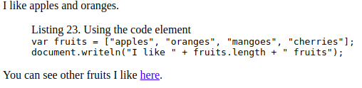
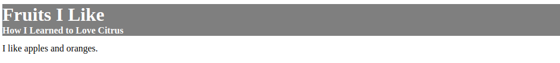

### Element Categories ###

* [MDN Reference](https://developer.mozilla.org/en-US/docs/Web/Guide/HTML/Content_categories#Flow_content)
* [relevant portions of the HTML specification](https://html.spec.whatwg.org/multipage/dom.html#kinds-of-content)

### Grouping Content ###

* 表示段落[p](https://html.spec.whatwg.org/multipage/grouping-content.html#the-p-element)
  - ```css
    p { display: block; margin-before: 1em; marge-after: 1em; margin-start:0; margin-end: 0; }
    ```
* 应用全局属性到一片内容上，可是不表示任何内容分组[div](https://html.spec.whatwg.org/multipage/grouping-content.html#the-div-element)
  - 最后的选择，　优先考虑语义元素
  - ```css
    div { display: block; }
    ```
* 保留ＨＴＭＬ文档中的布局[pre](https://html.spec.whatwg.org/multipage/grouping-content.html#the-pre-element)
  - ｐｒｅ阻止渲染时候空白符的合并
  - ```css
    pre { display: block; font-family: monospace; white-space: pre; margin: 1em 0; }
    ```
* 表示引自他处的内容[blockquote](https://html.spec.whatwg.org/multipage/grouping-content.html#the-blockquote-element)
  - 相比**q**, blockquote通常用在需要引用更多内容情况下
  - ```css
    blockquote { display: block; margin-before: 1em; margin-after: 1em; margin-start: 40px; margin-end: 40px; }
    ```
* 表示段落级别的主题转换[hr](https://html.spec.whatwg.org/multipage/grouping-content.html#the-hr-element)
  - ```css
    hr { display: block; margin-before: 0.5em; margin-after: 0.5em; margin-start: auto; margin-end: auto;
         border-style: inset; border-width: 1px; }
    ```
* 有序列表[ol](https://html.spec.whatwg.org/multipage/grouping-content.html#the-ol-element)
  - 可以通过ｔｙｐｅ属性设置标号类型
    - 1 十进制（默认）
    - a 小写拉丁字母
    - A 大写拉丁字母
    - i 小写罗马数字
    - Ｉ 大写罗马数字
  - 可以通过start属性设置首项编号值，另外可以通过ｌｉ的ｖａｌｕｅ强行指定某一项的值编号
  - reversed属性指定标号降序排列
  - ```css
    ol { display: block; list-style-type: decimal; margin-before: 1em; margin-after: 1em;
         margin-start: 0; margin-end: 0; padding-start: 40px;
       }
    ```
* 无序列表[ul](https://html.spec.whatwg.org/multipage/grouping-content.html#the-ul-element)
  - ```css
    ul { display: block; list-style-type: disc; margin-before: 1em; margin-after: 1em;
         margin-start: 0; margin-end: 0; padding-start: 40px;
       }
    ```
* 说明列表[dl](https://html.spec.whatwg.org/multipage/grouping-content.html#the-dl-element)
  - **dl**需要配合属于[dt](https://html.spec.whatwg.org/multipage/grouping-content.html#the-dt-element)和定义[dd](https://html.spec.whatwg.org/multipage/grouping-content.html#the-dd-element])
  - ```css
     dl { display: block; margin-before: 1em; margin-after: 1em; margin-start: 0; margin-end: 0; }
     dt { display: block; }
     dd { display: block; margin-start: 40px; }
     ```
* 表示插图[figure](https://html.spec.whatwg.org/multipage/grouping-content.html#the-figure-element)
  - ```html
    <figure>
      <figcaption>Listing 23. Using the code element</figcaption>
      <code>var fruits = ["apples", "oranges", "mangoes", "cherries"];<br>
      document.writeln("I like " + fruits.length + " fruits");
      </code>
    </figure>
    ```
  -  
  - ```css
    figure { display: block; margin-before: 1em; margin-after-after: 1em; margin-start: 40px; margin-after: 40px; }
    figcaption { display: block; }
    ```
### Section Element ###
* HTML文档内容的开始[body](https://html.spec.whatwg.org/multipage/sections.html#the-body-element)
  - ```css
    body { display: block; margin: 8px; }
    body:focus { outline: none; }
    ```
* 常用标题[h1-h3](https://html.spec.whatwg.org/multipage/sections.html#the-h1,-h2,-h3,-h4,-h5,-and-h6-elements)
  - ```css
    h1 { display: block; font-size: 2em; margin-before: 0.67em; margin-after: 0.67em;
        margin-start: 0; margin-end: 0; font-weight: bold;
       }
    ```
* 表示一组标题, 其中只有一个可以出现在文档大纲中[hgroup](https://html.spec.whatwg.org/multipage/sections.html#the-hgroup-element)
  - hgroup主要用来解决子标题的问题
  - ```html
    <hgroup>
      <h1>Fruits I Like</h1>
      <h2>How I Learned to Love Citrus</h2>
    </hgroup>
    I like apples and oranges.
    ```
  - 

### Text Element ###
* 生成到其他文档的超级链接或者到本文档某元素的超级链接[a](https://html.spec.whatwg.org/multipage/text-level-semantics.html#the-a-element)
  - ```css
    a:link, a:visited {
      color: blue;
      text-decoration: underline;
      cursor: auto;
    }
    a:link:active, a:visited:active {
      color: blue;
    }
    ```
  - link to an external location
    ```html
      <!-- anchor linking to external file -->
        <a href="https://www.mozilla.com/">
        External Link
      </a>
    ```
  - link to another element of the same document
    ```html
      <!-- links to element on this page with id="attr-href" -->
      <a href="#attr-href">
        Description of Same-Page Links
      </a>
    ```
  - make image link to external location
    ```html
      <a href="https://developer.mozilla.org/en-US/" target="_blank">
        
      </a>
    ```
  - attributes
    - target: specifies where to display the linked URL
* 不附带任何重要性含义地表示一段文本[b](https://html.spec.whatwg.org/multipage/text-level-semantics.html#the-b-element)或者[u](https://html.spec.whatwg.org/multipage/text-level-semantics.html#the-u-element)
  - ```css
    b { font-weight: bolder; }
    u { text-decoration: underline; }
    ```
  - 用户往往会把下划线的文字误认为超级链接，应该尽可能的避免使用ｕ元素
  - Perfer to use CSS [font-weight](https://developer.mozilla.org/en-US/docs/Web/CSS/font-weight) instead of `<b>`, if there is no semantic purpose to use `<b>` element, 
* 表示强调[em](https://html.spec.whatwg.org/multipage/text-level-semantics.html#the-em-element)
  - ```css
    em { font-style: italic; }
    ```
* 表示科学术语或者外文词汇[i](https://html.spec.whatwg.org/multipage/text-level-semantics.html#the-i-element)
  - ```css
    i { font-style: italic; }
    ```
* 表示不精确或者不正确的内容[s](https://html.spec.whatwg.org/multipage/text-level-semantics.html#the-s-element)
  - ```css
    s { text-decoration: line-through; }
    ```
* 表示重要[strong](https://html.spec.whatwg.org/multipage/text-level-semantics.html#the-strong-element)
  - ```css
    strong { font-weight: bolder; }
    ```
  - [`<b> vs <strong>, <em> vs <strong>`](https://developer.mozilla.org/en-US/docs/Web/HTML/Element/strong)
* 表示小号字体部分[small](https://html.spec.whatwg.org/multipage/text-level-semantics.html#the-small-element)
  - ```css
    small { font-size: smaller; }
    ```
  - 常用于免责和澄清说明
* 表示上标和下标[sub and sup](https://html.spec.whatwg.org/multipage/text-level-semantics.html#the-sub-and-sup-elements)
  - ```css
    sub { font-size: smaller; vertical-align: sub; }
    sup { font-size: smaller; vertical-align: super; }
    ```
* 表示换行[br](https://html.spec.whatwg.org/multipage/text-level-semantics.html#the-br-element)和适合换行处[wbr](https://html.spec.whatwg.org/multipage/text-level-semantics.html#the-wbr-element)
  - br只宜用在换行也是内容的一部分情况下。使用`<br/>`风格，尽量不使用`<br>`风格
* 表示计算机代码、程序输出、变量或者用户输入[code](https://html.spec.whatwg.org/multipage/text-level-semantics.html#the-code-element), [var](https://html.spec.whatwg.org/multipage/text-level-semantics.html#the-var-element), [samp](https://html.spec.whatwg.org/multipage/text-level-semantics.html#the-samp-element), [kbd](https://html.spec.whatwg.org/multipage/text-level-semantics.html#the-kbd-element)
  - ```css
    code { font-family: monospace; }
    var { font-style: italic; }
    samp { font-family: monospace; }
    kbd { font-family: monospace; }
    ```
* 在科学计算领域经常用到的缩写[abbr](https://html.spec.whatwg.org/multipage/text-level-semantics.html#the-abbr-element)， 
  标题引用[cite](https://html.spec.whatwg.org/multipage/text-level-semantics.html#the-cite-element), 引用内容[q](https://html.spec.whatwg.org/multipage/text-level-semantics.html#the-q-element), 和术语定义[dfn](https://html.spec.whatwg.org/multipage/text-level-semantics.html#the-dfn-element)
  - ```css
    abbr {}
    cite { font-style: italic; }
    q { display: inline; } 
    q:before { content: open-quote; }
    q:after { content: close-quote; }
    dfn {}
    ```
* 对一段内容应用全局属性[span](https://html.spec.whatwg.org/multipage/text-level-semantics.html#the-span-element)
  - ```css
    span {}
    ```
* 表示与另一段上下文有关的内容，并被突出显示[mask](https://html.spec.whatwg.org/multipage/text-level-semantics.html#the-mark-element)
  - ```css
    mask { background-color: yellow; color: black; }
    ```
* 表示添加的内容[ins](https://developer.mozilla.org/en-US/docs/Web/HTML/Element/ins)和删除的内容[del](https://developer.mozilla.org/en-US/docs/Web/HTML/Element/del)
  - ```css
    ins { text-decoration: underline; }
    del { text-decoration: line-through; }
    ```
* 表示日期和时间[time](https://html.spec.whatwg.org/multipage/text-level-semantics.html#the-time-element)
  - ```css
    time {}
    ```
  - ```html
    <p>The concert took place on <time
    datetime="2001-05-15T19:00">May 15</time>.</p>
    ```
